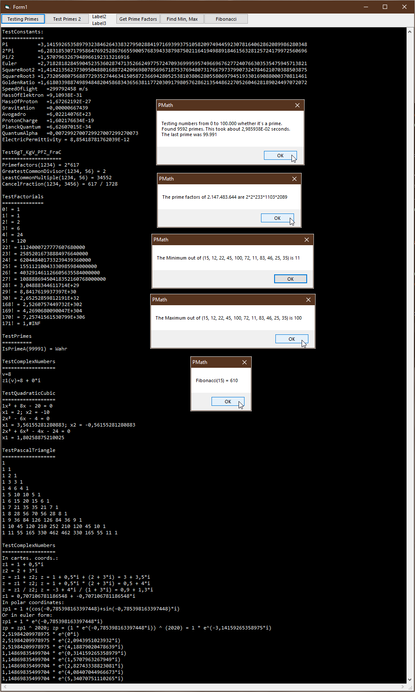

# Math  
## Important constants and math functions  

 

Important constants and basic math functions.  
Contains the following basic physics and math Constants:  
* Pi               circle-number        like 3.14... and Pi/2 and 2·Pi
* Euler            e-constant           like 2.71828...
* SquareRoot2      the square root of 2 like 1.4142...
* SquareRoot3      the square root of 3 like 1.732...
* GoldenRatio      the golden ratio     like 1.61803...
* SpeedOfLight     like c = 299792458 m/s
* ElemCharge       elementary charge of a proton     e   = 1.602176634 · 10^-19 C (Coulomb)
* MassElektron     resting mass of an electron       m_e = 9.109 · 10^-31 kg
* MassProton       resting mass of a  proton         m_p = 1.6726215813 · 10^-27 kg
* PlanckQuantum    Plancks Wirkungsquantum           h   = 6,62607015 · 10^(-37) m² · kg / s
* Avogadro         Avogadro-constant                 N_A = 6,022 · 10^23
* Gravitation      Newtons gravitational constant    G   = 6,6743 · 10^-11 m³ / (kg * s²)
* BoltzmannConst   Boltzmann-constant                k_B = 1,38064852 · 10^23 m2 kg s-2 K-1
* MagnPermittvy    magnetic field constant         mue_0 = µ0 ˜  1.2566370621219 · 10 ^-6 N/A²
* ElecPermittvy    electrical field constant       eps_0 = 8.854187812813 · 10-12 (A s)/(V m)
* QuantumAlpha     fine structure constant

Contains the following basic math functions:
* testing for IEEE positive and negative inifinite, Nob-a-number, indefined
* fibonacci 
* all possible factorial numbers
* greatest common divisor, least-common-multiple, prime-factorisation, cancel-fration, 
* linear interpolation
* testing a number for prime, GetNextPrime, GetRandomPrime, contains all primes up to 100000
* Min and Max for all primitive numeric datatypes
* Logarithm naturale (to base e), to base 10, to a given base
* Atan2 and SinusCardinalis (aka sinc)
* checking for zero, is-equal
* rounding, round-up, round-down, floor, ceiling
* solving quadratic formula, squareroot 
* solving cubic formula, cuberoot
* calculating with complex-numbers 
* pascal triangles
* modulo function for floating-points
* calculation of Pi

