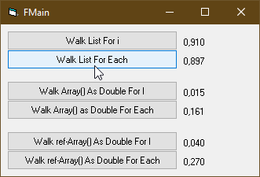

# <App_Name>  
## <App short description>  

[](https://github.com/OlimilO1402/<App_Name>/blob/master/LICENSE) 
[](https://github.com/OlimilO1402/<App_Name>/releases/latest)
[](https://github.com/OlimilO1402/<App_Name>/releases/download/v1.0.0/<App_Name>_v1.0.0.zip)


Project started around mid 2012.  
This example shows how to implement the IEnumVariant-Interface for supporting the "for each"-language-feature in your own list class, by using a lightweight-object. The contained list-class is just an example of a prototype of a list.  

```vba
Public Function Foo() As Variant
	'
End Function
```

[Link text Here](https://link-url-here.org) 


